# Biconline

> O projeto de biconline soluções para autônomos tem como objetivo fornecer uma plataforma completa para prestadores de serviços e clientes, permitindo que ambos possam se conectar de forma eficiente e segura. A plataforma conta com diversas funcionalidades, como cadastro de clientes e prestadores de serviços, sistema de busca por prestadores de serviços utilizando filtros de busca, agendamento de serviços, avaliação dos serviços, gerenciamento de serviços para os prestadores, área para dúvidas frequentes e gerenciamento de solicitações de serviços.
O cadastro de clientes e prestadores de serviços permitirá que ambos possam criar perfis detalhados, incluindo informações sobre suas habilidades para prestadores. Os clientes poderão pesquisar prestadores de serviços com base em filtros de busca, como localização, especialidade, e agendar serviços diretamente pela plataforma.
O sistema de avaliação dos serviços permitirá que os clientes avaliem a qualidade dos serviços prestados pelos autônomos, incentivando a prestação de serviços de alta qualidade e ajudando outros clientes a tomar decisões informadas ao escolher um prestador de serviços.
O gerenciamento de serviços para os prestadores incluirá ferramentas para gerenciar os serviços fornecidos pelo prestador, podendo inserir, alterar e excluir, ajudando assim os prestadores a gerenciar melhor seus negócios.
A área para dúvidas frequentes permitirá que os clientes e prestadores de serviços obtenham respostas para as perguntas mais comuns, tornando o uso da plataforma mais fácil e intuitivo.
Por fim, o gerenciamento de solicitações de serviços permitirá que os clientes e prestadores gerenciem as solicitações de serviços diretamente pela plataforma podendo consultar, alterar ou cancelar de maneira intuitiva e eficaz.
Com todas essas funcionalidades, espera-se que a plataforma possa ajudar autônomos a encontrar novos clientes e gerenciar seus negócios com mais eficiência, enquanto os clientes podem encontrar prestadores de serviços confiáveis e de qualidade.

Link para download do projeto backend: https://github.com/AlnDevE/biconline-api

## ⚙️ Funcionalidades

- [x] 

## ⚙️ Funcionalidades Futuras

- [x] 

## 💻 Preview

    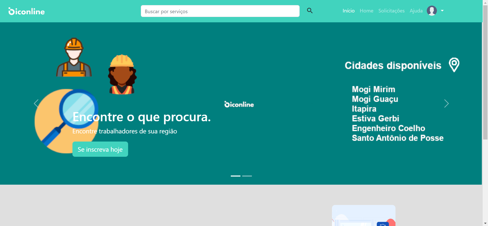
    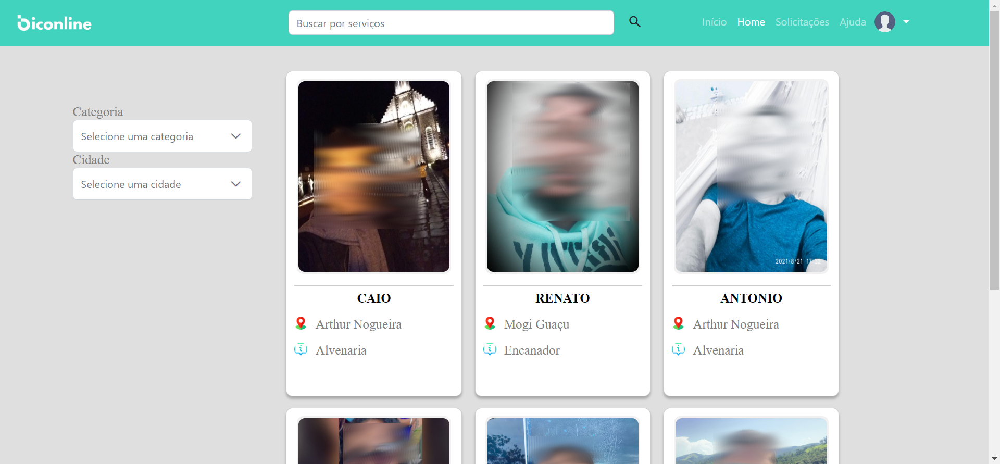

    
    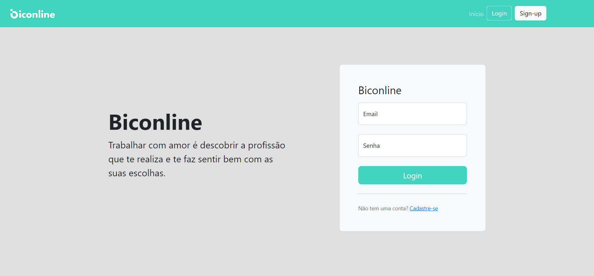

    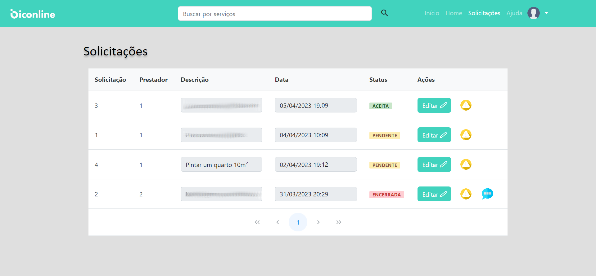
    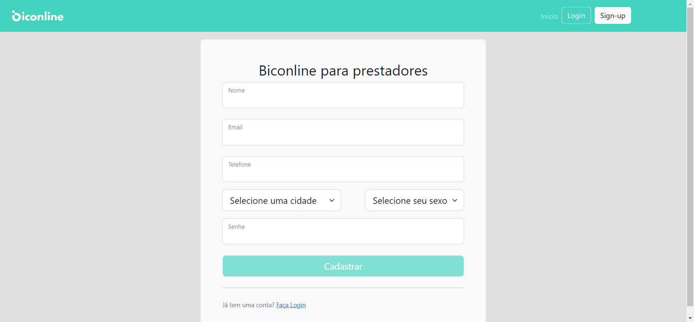

    
    

    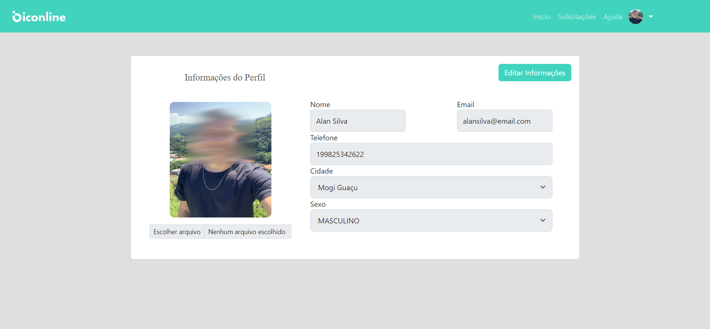
    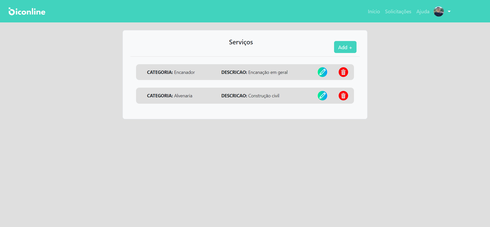

    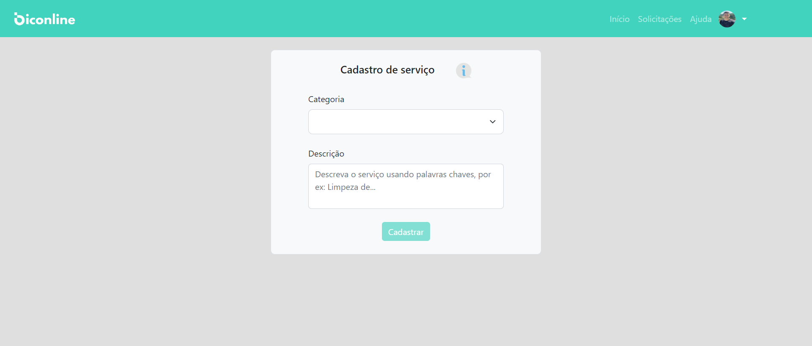
    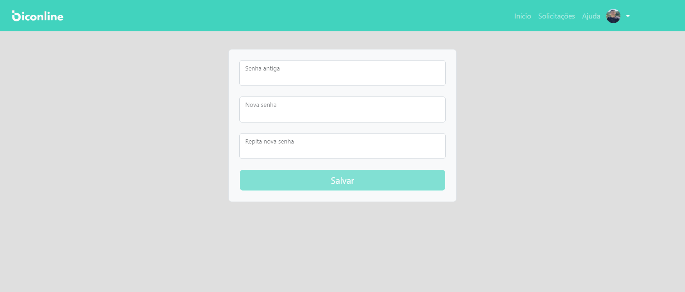

    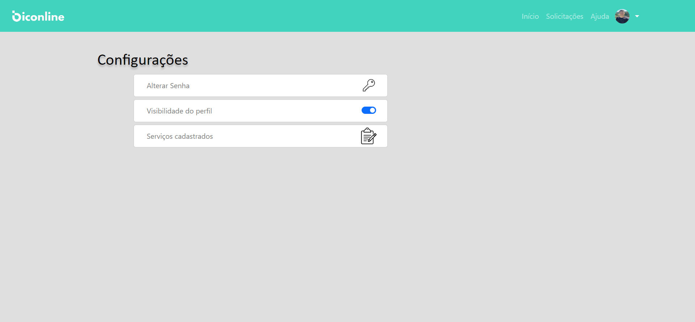
    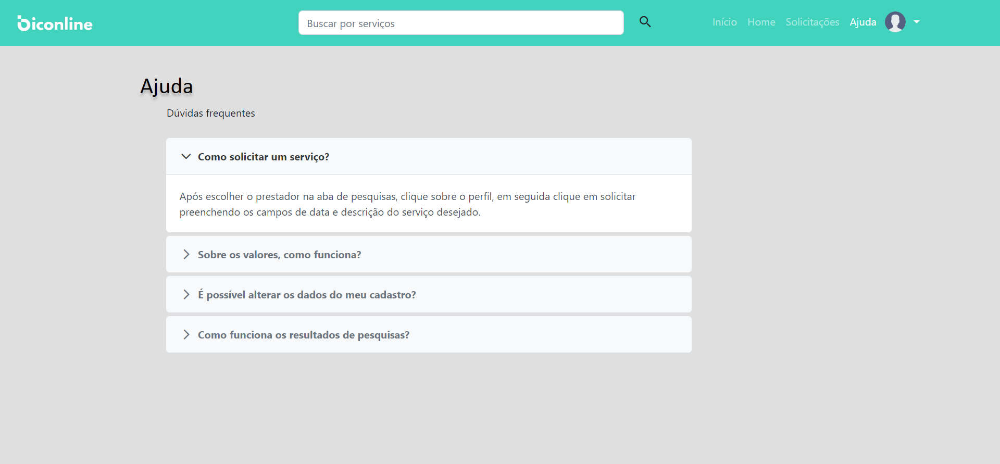

## 💻 Development server

Antes de começar, verifique se você atendeu aos seguintes requisitos:

* Ter instalado o Node.

Após isso, execute o comando "npm i" no diretório raiz para instalar as dependências do projeto. Navegue até http://localhost:4200/. O aplicativo será recarregado automaticamente se você alterar qualquer um dos arquivos de origem.

[⬆ Voltar ao topo](#biconline-angular) 
